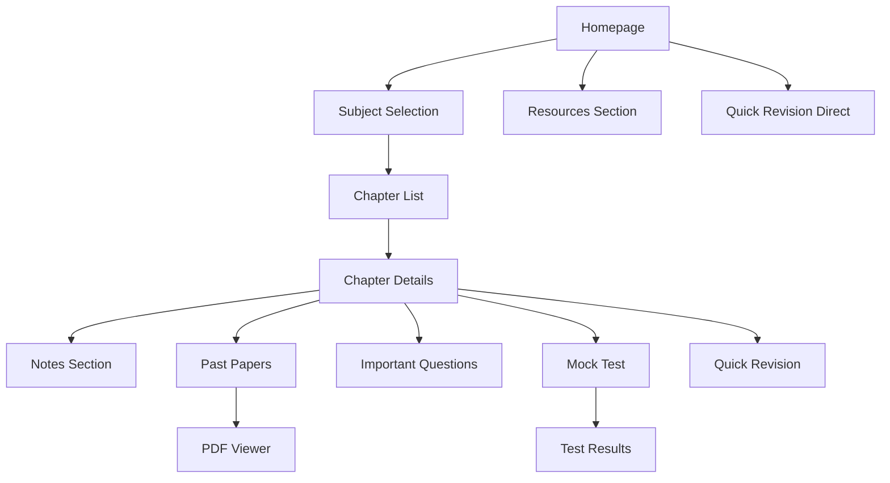

## 1. Product Overview
A comprehensive online study platform designed specifically for NEB +2 Science students in Nepal. The platform provides structured learning materials, practice tests, and revision resources for Physics, Chemistry, Mathematics, and Computer Science subjects.

This educational platform helps students prepare effectively for their board examinations by providing organized study materials, past papers, mock tests, and quick revision tools all in one accessible location.

## 2. Core Features

### 2.1 User Roles
| Role | Registration Method | Core Permissions |
|------|---------------------|------------------|
| Student | Email registration | Access all study materials, take tests, download resources |
| Guest User | No registration required | Browse limited content, view sample materials |

### 2.2 Feature Module
The NEB Science Platform consists of the following main pages:
1. **Homepage**: Hero section with call-to-action buttons, subject cards for easy navigation
2. **Subject Pages**: Chapter listings for Physics, Chemistry, Mathematics, and Computer Science
3. **Chapter Detail Pages**: Notes, past papers, important questions, formulas, and mock tests
4. **Past Papers Section**: Filterable PDF downloads with solved answers
5. **Mock Test System**: Chapter-wise and full subject tests with auto-scoring
6. **Quick Revision Section**: Formula sheets and important definitions
7. **Resources Section**: Syllabus downloads, practical questions, and diagrams

### 2.3 Page Details
| Page Name | Module Name | Feature description |
|-----------|-------------|---------------------|
| Homepage | Hero Section | Display title "Complete NEB Science Preparation Platform" with compelling subtitle |
| Homepage | CTA Buttons | Four main buttons: Start Studying, Past Papers, Mock Test, Important Questions |
| Homepage | Subject Cards | Four clickable cards showing Physics, Chemistry, Mathematics, Computer Science with icons |
| Subject Page | Chapter List | Display all chapters for selected subject with progress indicators |
| Chapter Detail | Notes Section | Show chapter-wise notes with formulas, derivations, diagrams, reactions, programs |
| Chapter Detail | Past Papers | List relevant past paper questions with download links and view online option |
| Chapter Detail | Important Questions | Highlight frequently asked questions with detailed solutions |
| Chapter Detail | Formulas Section | Quick reference formulas and key concepts for revision |
| Chapter Detail | Mock Test | Start chapter-specific test with multiple question types |
| Past Papers | Filter System | Filter by year (2075-2082) and topic/chapter with search functionality |
| Past Papers | PDF Viewer | Online PDF viewer with download option and zoom controls |
| Mock Test | Test Interface | Timer display, question navigation, answer selection for MCQ/short/long questions |
| Mock Test | Results Page | Show score, correct answers, weak topic identification, and improvement suggestions |
| Quick Revision | Formula Sheets | Organized formula collections by subject with search function |
| Quick Revision | Key Definitions | Important terms and definitions for Computer Science |
| Resources | NEB Syllabus | Downloadable PDF of official NEB syllabus |
| Resources | Practical Questions | Lab practical questions with step-by-step solutions |
| Resources | Viva Questions | Common viva questions with model answers |
| Resources | Diagrams | Important scientific diagrams with labels and explanations |

## 3. Core Process

### Student Flow
1. Student lands on homepage and sees subject options
2. Clicks on desired subject (Physics/Chemistry/Mathematics/Computer Science)
3. Views chapter list and selects specific chapter
4. Accesses study materials: notes, past papers, important questions
5. Takes mock tests to assess understanding
6. Uses quick revision tools for final preparation
7. Downloads additional resources like syllabus and practical questions

### Guest User Flow
1. Can browse homepage and view sample content
2. Limited access to full study materials
3. Encouraged to register for complete access

## 4. User Interface Design

### 4.1 Design Style
- **Primary Colors**: Deep blue (#1e40af) for headers, emerald (#10b981) for accents
- **Secondary Colors**: Light gray (#f3f4f6) backgrounds, white cards with subtle shadows
- **Button Style**: Rounded corners (8px radius), hover effects, clear call-to-action colors
- **Typography**: Inter font family, 16px base size, responsive scaling
- **Layout**: Card-based design with consistent spacing, top navigation bar
- **Icons**: Modern line icons, subject-specific symbols (atom for Chemistry, calculator for Math)

### 4.2 Page Design Overview
| Page Name | Module Name | UI Elements |
|-----------|-------------|-------------|
| Homepage | Hero Section | Full-width gradient background, centered title with 48px font, subtitle 20px, four prominent CTA buttons in a row |
| Homepage | Subject Cards | 2x2 grid layout on desktop, single column on mobile, card height 200px, hover lift effect, subject icons 64px |
| Subject Page | Chapter List | Clean list layout with chapter numbers, completion checkmarks, estimated study time |
| Chapter Detail | Content Tabs | Horizontal tab navigation for Notes/Papers/Questions/Tests, active tab highlighted |
| Past Papers | Filter Bar | Dropdown selectors for year and topic, search input with icon, clear filter button |
| Mock Test | Test Interface | Progress bar at top, timer in corner, question navigation sidebar, submit button prominently placed |
| Quick Revision | Formula Grid | Responsive grid layout, formula cards with copy button, subject color coding |

### 4.3 Responsiveness
- **Desktop-first approach**: Optimized for 1280px+ screens
- **Mobile adaptation**: Single column layouts, hamburger menu for navigation
- **Touch optimization**: Larger tap targets (minimum 44px), swipe gestures for navigation
- **Breakpoints**: 640px (mobile), 768px (tablet), 1024px (desktop)

### 4.4 Dark Mode Support
- Automatic system preference detection
- Manual toggle in navigation
- Dark backgrounds (#0f172a), light text colors
- Reduced brightness for images and diagrams
- Maintained color contrast ratios for accessibility