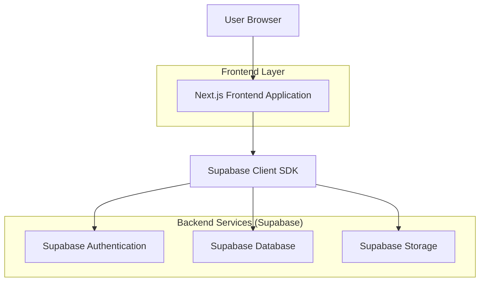
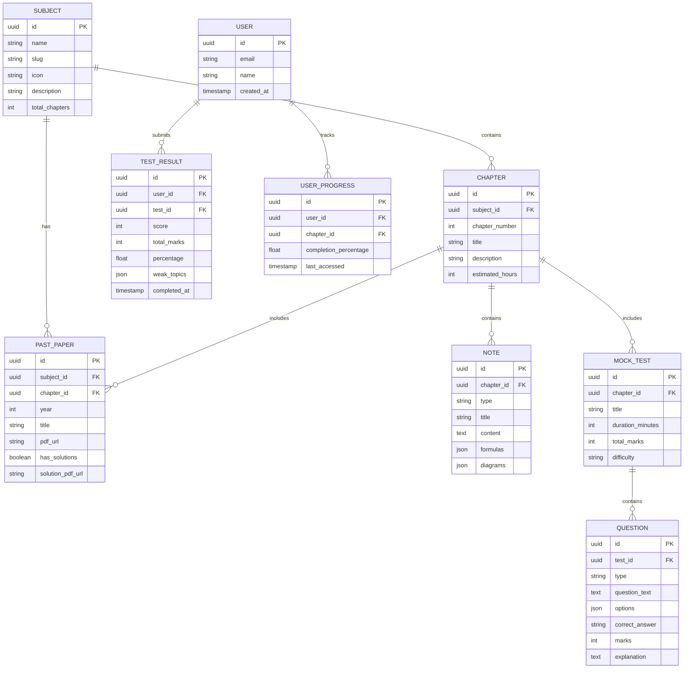

## 1. Architecture design



## 2. Technology Description

- **Frontend**: Next.js@14 + React@18 + Tailwind CSS@3
- **Initialization Tool**: create-next-app
- **Backend**: Supabase (BaaS)
- **Database**: PostgreSQL (via Supabase)
- **Storage**: Supabase Storage for PDFs and images
- **Authentication**: Supabase Auth
- **State Management**: React Context + useState hooks
- **Routing**: Next.js App Router

## 3. Route definitions

| Route | Purpose |
|-------|---------|
| / | Homepage with hero section and subject cards |
| /subjects/[subject] | Subject page showing chapter list |
| /subjects/[subject]/[chapter] | Chapter detail page with tabs for notes/papers/questions |
| /past-papers | Past papers browser with filters |
| /mock-test | Mock test selection and interface |
| /quick-revision | Formula sheets and key definitions |
| /resources | Downloadable resources section |
| /login | User authentication page |
| /profile | User dashboard and progress tracking |

## 4. API definitions

### 4.1 Core API Endpoints

**Subject and Chapter Data**
```
GET /api/subjects
GET /api/subjects/[id]/chapters
GET /api/chapters/[id]
```

**Past Papers**
```
GET /api/past-papers?subject=&year=&chapter=
GET /api/past-papers/[id]/download
```

**Mock Tests**
```
GET /api/tests?subject=&chapter=
POST /api/tests/[id]/submit
GET /api/tests/[id]/results
```

**User Progress**
```
GET /api/user/progress
POST /api/user/progress/update
```

### 4.2 Data Types

```typescript
interface Subject {
  id: string;
  name: string;
  slug: string;
  icon: string;
  description: string;
  totalChapters: number;
}

interface Chapter {
  id: string;
  subjectId: string;
  number: number;
  title: string;
  description: string;
  estimatedHours: number;
}

interface PastPaper {
  id: string;
  subjectId: string;
  chapterId: string;
  year: number;
  title: string;
  pdfUrl: string;
  hasSolutions: boolean;
  solutionPdfUrl?: string;
}

interface Question {
  id: string;
  testId: string;
  type: 'multiple-choice' | 'short-answer' | 'long-answer';
  question: string;
  options?: string[];
  correctAnswer: string | number;
  marks: number;
  explanation?: string;
}

interface TestResult {
  id: string;
  userId: string;
  testId: string;
  score: number;
  totalMarks: number;
  percentage: number;
  weakTopics: string[];
  completedAt: Date;
}
```

## 5. Server architecture diagram

Since we're using Supabase as a Backend-as-a-Service, the server-side logic is handled by Supabase's managed services. The architecture follows a client-server model where:

- Next.js application runs on the client side
- Supabase handles authentication, database operations, and file storage
- No separate backend server is required

## 6. Data model

### 6.1 Data model definition



### 6.2 Data Definition Language

**Subjects Table**
```sql
CREATE TABLE subjects (
    id UUID PRIMARY KEY DEFAULT gen_random_uuid(),
    name VARCHAR(100) NOT NULL,
    slug VARCHAR(100) UNIQUE NOT NULL,
    icon VARCHAR(50) NOT NULL,
    description TEXT,
    total_chapters INTEGER DEFAULT 0,
    created_at TIMESTAMP WITH TIME ZONE DEFAULT NOW()
);

-- Grant permissions
GRANT SELECT ON subjects TO anon;
GRANT ALL PRIVILEGES ON subjects TO authenticated;
```

**Chapters Table**
```sql
CREATE TABLE chapters (
    id UUID PRIMARY KEY DEFAULT gen_random_uuid(),
    subject_id UUID REFERENCES subjects(id) ON DELETE CASCADE,
    chapter_number INTEGER NOT NULL,
    title VARCHAR(200) NOT NULL,
    description TEXT,
    estimated_hours INTEGER DEFAULT 1,
    created_at TIMESTAMP WITH TIME ZONE DEFAULT NOW()
);

-- Grant permissions
GRANT SELECT ON chapters TO anon;
GRANT ALL PRIVILEGES ON chapters TO authenticated;
```

**Past Papers Table**
```sql
CREATE TABLE past_papers (
    id UUID PRIMARY KEY DEFAULT gen_random_uuid(),
    subject_id UUID REFERENCES subjects(id) ON DELETE CASCADE,
    chapter_id UUID REFERENCES chapters(id) ON DELETE CASCADE,
    year INTEGER NOT NULL CHECK (year BETWEEN 2075 AND 2082),
    title VARCHAR(300) NOT NULL,
    pdf_url TEXT NOT NULL,
    has_solutions BOOLEAN DEFAULT false,
    solution_pdf_url TEXT,
    created_at TIMESTAMP WITH TIME ZONE DEFAULT NOW()
);

-- Grant permissions
GRANT SELECT ON past_papers TO anon;
GRANT ALL PRIVILEGES ON past_papers TO authenticated;
```

**Notes Table**
```sql
CREATE TABLE notes (
    id UUID PRIMARY KEY DEFAULT gen_random_uuid(),
    chapter_id UUID REFERENCES chapters(id) ON DELETE CASCADE,
    type VARCHAR(50) NOT NULL CHECK (type IN ('theory', 'formula', 'derivation', 'diagram')),
    title VARCHAR(200) NOT NULL,
    content TEXT NOT NULL,
    formulas JSONB,
    diagrams JSONB,
    created_at TIMESTAMP WITH TIME ZONE DEFAULT NOW()
);

-- Grant permissions
GRANT SELECT ON notes TO anon;
GRANT ALL PRIVILEGES ON notes TO authenticated;
```

**Mock Tests Table**
```sql
CREATE TABLE mock_tests (
    id UUID PRIMARY KEY DEFAULT gen_random_uuid(),
    chapter_id UUID REFERENCES chapters(id) ON DELETE CASCADE,
    title VARCHAR(200) NOT NULL,
    duration_minutes INTEGER NOT NULL DEFAULT 30,
    total_marks INTEGER NOT NULL DEFAULT 50,
    difficulty VARCHAR(20) DEFAULT 'medium' CHECK (difficulty IN ('easy', 'medium', 'hard')),
    created_at TIMESTAMP WITH TIME ZONE DEFAULT NOW()
);

-- Grant permissions
GRANT SELECT ON mock_tests TO anon;
GRANT ALL PRIVILEGES ON mock_tests TO authenticated;
```

**Questions Table**
```sql
CREATE TABLE questions (
    id UUID PRIMARY KEY DEFAULT gen_random_uuid(),
    test_id UUID REFERENCES mock_tests(id) ON DELETE CASCADE,
    type VARCHAR(50) NOT NULL CHECK (type IN ('multiple-choice', 'short-answer', 'long-answer')),
    question_text TEXT NOT NULL,
    options JSONB,
    correct_answer TEXT NOT NULL,
    marks INTEGER NOT NULL DEFAULT 1,
    explanation TEXT,
    created_at TIMESTAMP WITH TIME ZONE DEFAULT NOW()
);

-- Grant permissions
GRANT SELECT ON questions TO anon;
GRANT ALL PRIVILEGES ON questions TO authenticated;
```

**Test Results Table**
```sql
CREATE TABLE test_results (
    id UUID PRIMARY KEY DEFAULT gen_random_uuid(),
    user_id UUID REFERENCES auth.users(id) ON DELETE CASCADE,
    test_id UUID REFERENCES mock_tests(id) ON DELETE CASCADE,
    score INTEGER NOT NULL,
    total_marks INTEGER NOT NULL,
    percentage FLOAT NOT NULL,
    weak_topics JSONB,
    completed_at TIMESTAMP WITH TIME ZONE DEFAULT NOW()
);

-- Grant permissions
GRANT ALL PRIVILEGES ON test_results TO authenticated;
```

**User Progress Table**
```sql
CREATE TABLE user_progress (
    id UUID PRIMARY KEY DEFAULT gen_random_uuid(),
    user_id UUID REFERENCES auth.users(id) ON DELETE CASCADE,
    chapter_id UUID REFERENCES chapters(id) ON DELETE CASCADE,
    completion_percentage FLOAT DEFAULT 0 CHECK (completion_percentage BETWEEN 0 AND 100),
    last_accessed TIMESTAMP WITH TIME ZONE DEFAULT NOW(),
    UNIQUE(user_id, chapter_id)
);

-- Grant permissions
GRANT ALL PRIVILEGES ON user_progress TO authenticated;
```

**Row Level Security Policies**
```sql
-- Test results can only be viewed by the user who created them
CREATE POLICY "Users can view own test results" ON test_results
    FOR SELECT USING (auth.uid() = user_id);

-- User progress can only be viewed/modified by the user
CREATE POLICY "Users can manage own progress" ON user_progress
    FOR ALL USING (auth.uid() = user_id);
```